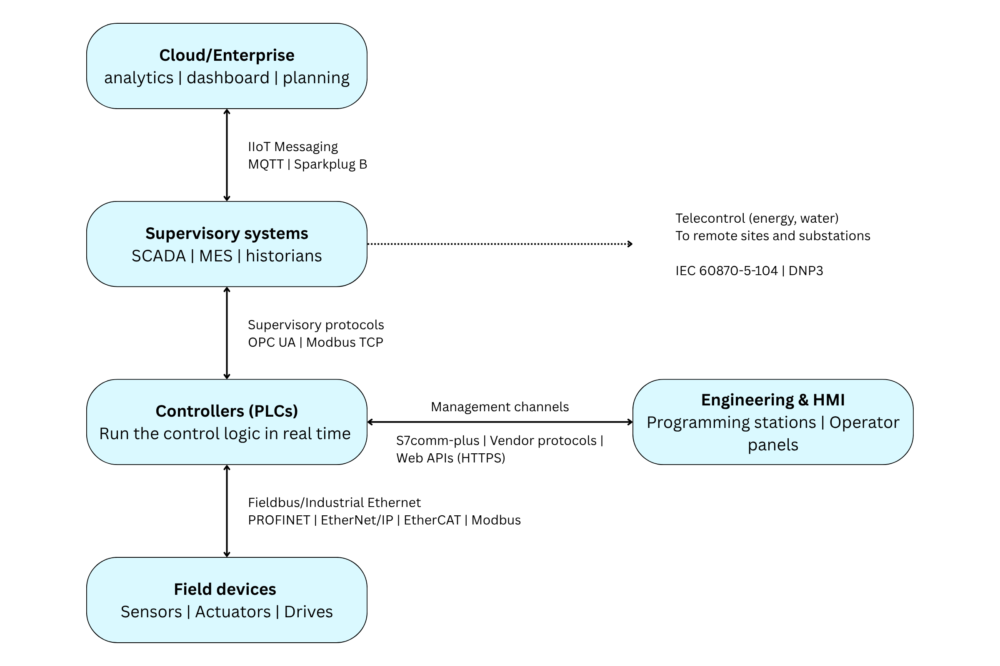

## Executive Summary

Industrial plants do not run on one network protocol. A single facility typically speaks several at once, each serving a different layer of the operation: field devices exchanging real-time signals with controllers, engineering stations programming those controllers, supervisory systems collecting data from them, and cloud platforms receiving it all. Public discussion of OT security often blurs these layers together, which makes it hard to reason about what any given protocol actually does or where any given product actually sits. This briefing is a reference map. It explains, in plain terms, how the layers of an industrial system communicate, which protocols dominate each layer, who the major controller vendors are, and how vendors and protocols relate to each other. It is informational by design: it argues no thesis and evaluates no product.

## 1. What this briefing is

This is a field guide, not an analysis. It exists because conversations about industrial cybersecurity constantly reference protocols (PROFINET, Modbus, OPC UA) and vendors (Siemens, Rockwell, Mitsubishi) as if the map connecting them were common knowledge. It is not, and the map is genuinely useful: which protocol a system speaks determines what an operator can connect, what an integrator must support, and what a security tool can observe. The companion briefing in this series, LB-2026-02, examines how security and encryption land across these protocols [1]; this one only draws the map.

A note on numbers. Reliable quantitative data exists for some of this landscape and not for the rest. Where we cite figures, they come from the one recurring industry analysis of network node shares [2] and should be read as directional. Where no measurement exists, notably for vendor market shares, we describe the picture qualitatively rather than lending false precision to diverging analyst estimates.

## 2. How a plant communicates

Figure 1 shows the layers of a typical industrial system and the protocol families that connect them.

<figure>

<figcaption>Figure 1. The communication layers of a typical industrial system. Each arrow is a different protocol family serving a different purpose.</figcaption>
</figure>

At the bottom sit the **field devices**: the sensors that measure the process, the actuators and valves that act on it, the drives that turn motors, and the remote IO racks that gather signals. They have no intelligence of their own worth speaking of; they report to, and take orders from, the layer above.

That layer is the **controller**, usually a PLC (programmable logic controller): a rugged industrial computer that runs the control logic in real time. The PLC reads its inputs, executes its program, and writes its outputs, over and over, on a cycle measured in milliseconds. The network between the controller and its field devices is what the industry calls a **fieldbus**, or in its modern Ethernet-based form, **Industrial Ethernet**. Its defining trait is cyclic, deterministic, real-time traffic: the same IO data exchanged continuously on a fixed clock.

To the side of the controller sit the **engineering station and the HMI**. The engineering station is the PC where an engineer writes and downloads the control program; the HMI (human-machine interface) is the operator's panel, where a person watches the process and adjusts setpoints. Both talk to the controller over what we will call **management channels**: the vendor's own protocol for programming, diagnostics, and operator interaction. This traffic is not cyclic IO; it is commands, parameters, and program transfers.

Above the controller sits the **supervisory layer**: SCADA systems that monitor and command many controllers at once, MES systems that connect production to business planning, and historians that archive process data. The traffic here is reads and writes of process variables at human timescales, seconds rather than milliseconds, and it increasingly runs over one vendor-neutral protocol, OPC UA.

In geographically distributed industries, energy and water above all, a further pattern appears: **telecontrol**, where a central control room communicates with remote sites and substations over dedicated protocols built for wide-area links.

Finally, at the top, the **IIoT layer** carries selected data out of the plant to cloud platforms and enterprise systems, typically through a message broker: a central post office to which devices publish data and from which applications subscribe to it.

Five layers, five kinds of traffic, and, as the next section shows, largely five different sets of protocols.

## 3. The protocols, layer by layer

Table 1 lists the protocols most likely to be encountered at each layer.

| Layer | Protocol | What it connects | Open or proprietary | Where it is common |
|---|---|---|---|---|
| Field | PROFINET | PLC to field devices | Open standard (PI) | Europe; Siemens ecosystems; ~27% of new nodes [2] |
| Field | EtherNet/IP | PLC to field devices | Open standard (ODVA) | North America; Rockwell ecosystems; ~23% of new nodes [2] |
| Field | EtherCAT | PLC to field devices | Open standard (ETG) | Machine building, motion control; ~17% of new nodes [2] |
| Field | CC-Link IE | PLC to field devices | Open standard (CLPA) | Japan and Asia; Mitsubishi ecosystems |
| Field / legacy | Modbus RTU and TCP | PLC to devices and to other systems | Open standard (Modbus Org.) | Everywhere as a legacy and interoperability workhorse; ~4% of new factory nodes but a very large installed base [2] |
| Management | S7comm-plus | Siemens engineering and HMI to Siemens PLCs | Proprietary (Siemens) | Every Siemens installation |
| Management | Vendor channels (CIP explicit messaging, UMAS, and others) | Each vendor's tools to its own PLCs | Proprietary per vendor | Proportional to each vendor's installed base |
| Management | Controller Web APIs | Browsers and applications to the PLC over HTTPS | Proprietary per vendor | Growing class on current controller generations |
| Supervisory | OPC UA | Controllers and devices to SCADA, MES, historians, cloud | Open standard (OPC Foundation, IEC 62541) | The vendor-neutral supervisory standard, across all ecosystems |
| Telecontrol | IEC 60870-5-104 | Control centre to remote sites | Open standard (IEC) | Energy and water, Europe and Asia |
| Telecontrol | DNP3 | Control centre to remote sites | Open standard (IEEE 1815) | Energy and water, the Americas |
| Substation | IEC 61850 | Protection and control devices within and between substations | Open standard (IEC) | Power substations worldwide |
| IIoT | MQTT with Sparkplug B | Edge devices to broker to cloud | Open standards (OASIS, Eclipse) | Edge-to-cloud telemetry across industries |

Table 1. The most common OT protocols by layer. Node-share figures are for new factory-automation nodes [2] and are directional.

A few of these deserve a sentence of plain language.

**Modbus** is the oldest name on the list, dating to 1979, and survives because it is simple and universal: nearly every industrial device can speak it, which makes it the duct tape of industrial integration. **PROFINET, EtherNet/IP, EtherCAT and CC-Link IE** are the four modern Industrial Ethernet families; they do the same job in different ecosystems, and choosing a controller vendor largely chooses among them. **OPC UA** is the one protocol designed to cut across all vendors: it gives every system, from any manufacturer, a common way to expose its data upward, which is why it dominates the supervisory layer and is the closest thing OT has to a lingua franca. **IEC 61850** is a world of its own inside power substations, where protection devices must react to grid faults within milliseconds. And **MQTT** is not an industrial protocol by origin at all; it is internet-era messaging technology that industry adopted for moving data to the cloud, with Sparkplug B as the convention that makes industrial devices speak it consistently.

## 4. Who makes the controllers

The controller market is concentrated: a handful of vendors account for the large majority of PLCs sold worldwide, with a long tail of regional and niche players. Analyst estimates of exact market shares diverge considerably, so Table 2 stays qualitative; the regional pattern, by contrast, is consistent across every source [3].

| Vendor | Flagship controller lines | Native protocol ecosystem | Strongest presence |
|---|---|---|---|
| Siemens | SIMATIC S7-1200, S7-1500 (TIA Portal) | PROFINET, S7comm-plus, OPC UA | Global leader; dominant in Europe |
| Rockwell Automation (Allen-Bradley) | ControlLogix, CompactLogix (Studio 5000) | EtherNet/IP (CIP) | Leader in North America |
| Mitsubishi Electric | MELSEC iQ-R, iQ-F (GX Works) | CC-Link IE, SLMP | Leader in Japan; strong across Asia |
| Schneider Electric | Modicon M340, M580 (EcoStruxure) | Modbus TCP, UMAS | Europe; energy and infrastructure |
| ABB (including B&R) | AC500; B&R X20 | ABB protocols; POWERLINK | Process industries and energy |
| Omron | NX, NJ series (Sysmac) | EtherNet/IP, EtherCAT | Asia; compact machine automation |
| Others | Beckhoff, Phoenix Contact, Emerson, Bosch Rexroth, WAGO, Delta and more | Various | Regional and application niches |

Table 2. The major PLC vendors. Ordering reflects the consistent qualitative picture across analyst sources; precise share figures diverge between analysts and are omitted deliberately.

## 5. Reading the map

Three observations tie the two tables together.

First, **at the field level, the protocol map and the vendor map are largely the same map**. PROFINET tracks Siemens installations, EtherNet/IP tracks Rockwell, CC-Link tracks Mitsubishi, EtherCAT tracks Beckhoff and the machine builders. The protocols are open standards on paper, and genuinely multi-vendor at the device level, but each is anchored to one controller ecosystem, so regional vendor strength and regional protocol share mirror each other.

Second, **management channels are the invisible layer**. Every controller has one, every vendor's is different, and no industry analysis measures them, because they are not a market anyone buys separately: they come with the PLC. Yet this is the layer that carries program downloads and operator commands, and any statement about how widespread a given management protocol is can only be an inference from controller market shares.

Third, **OPC UA is the exception to everything above**. It is the one widely deployed protocol that belongs to no vendor ecosystem, appears at the supervisory layer of plants from every manufacturer, and is designed to be the common upward-facing interface of the whole field. Whatever mix of vendors and fieldbuses a facility runs, the layer where its systems meet is increasingly an OPC UA layer.

How security and encryption are distributed across these same layers, which of this traffic is readable on the network and which is not, and what that means for observing industrial systems, is the subject of the companion briefing LB-2026-02 [1].

## References

[1] B. Salmazo. The Encryption of Operational Technology: A Protocol Landscape. Liscere Briefing LB-2026-02, 2026.

[2] HMS Networks. Industrial network market shares 2025. Annual analysis, May 2025.

[3] Composite of analyst coverage of the PLC market, 2025-2026 (GM Insights; IMARC; Mordor Intelligence; and others). Estimates of vendor shares diverge between sources; this briefing intentionally reports only the qualitative picture on which they agree.
