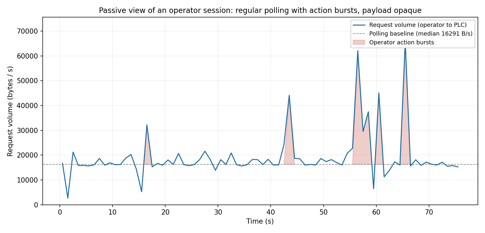
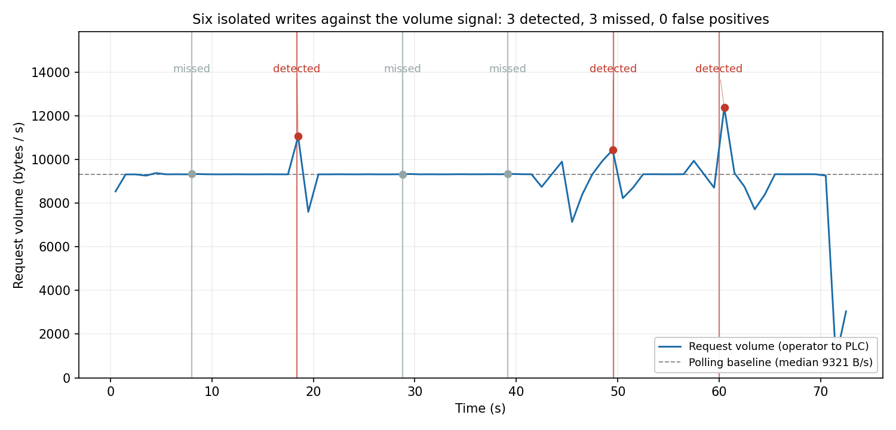
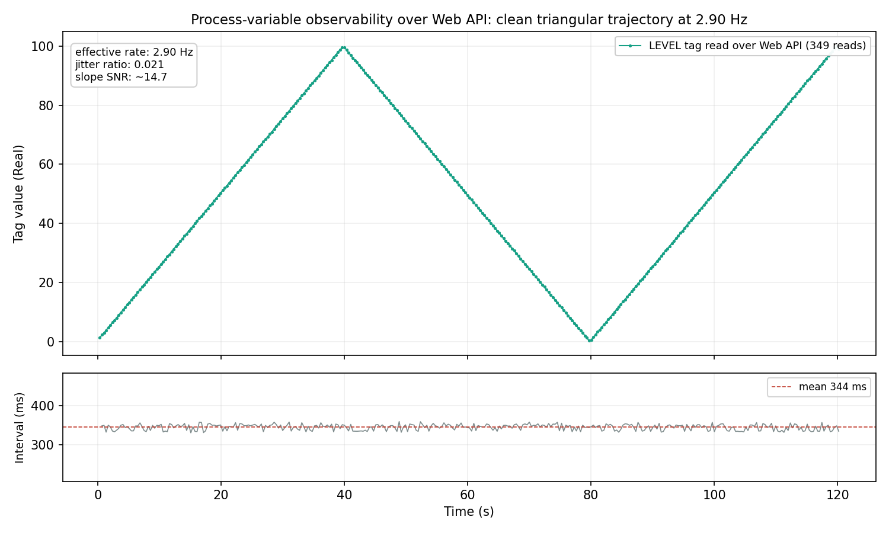
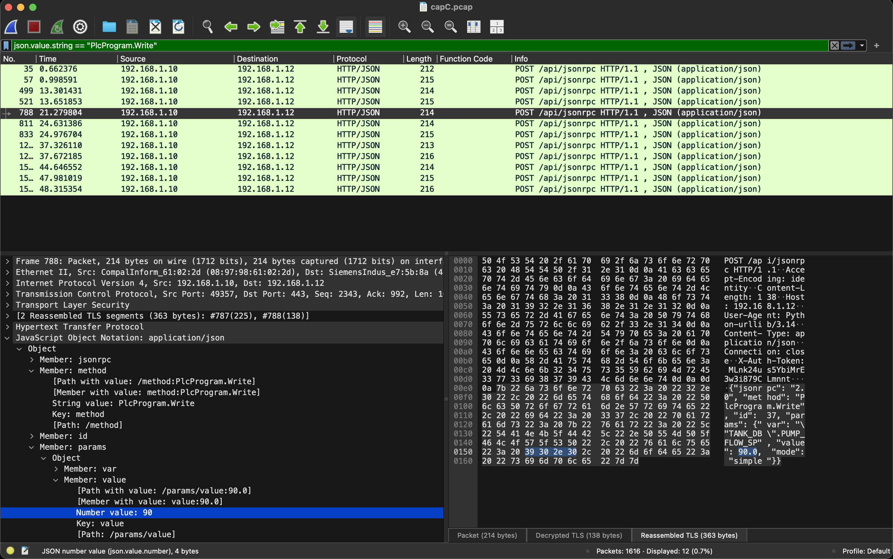
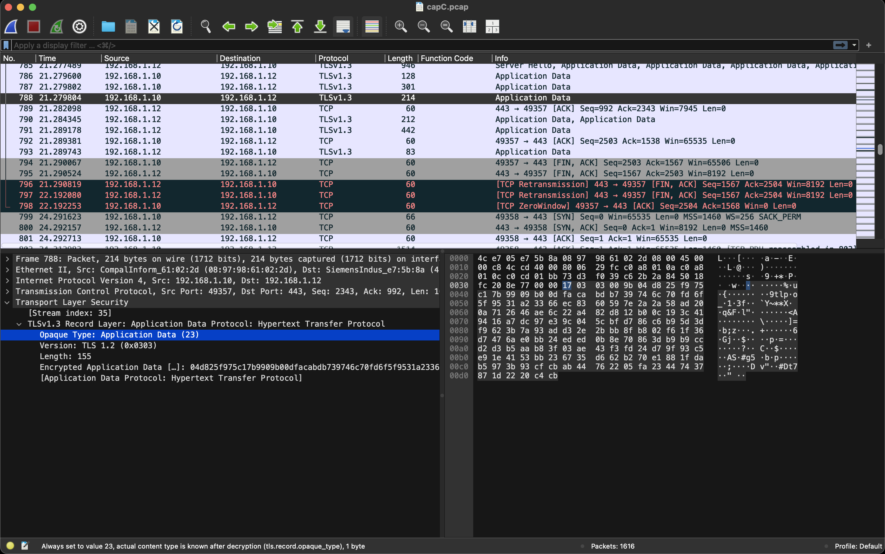

## Abstract

Encryption is arriving in operational technology. Protocols that historically carried control traffic in clear, from Modbus/TCP to native controller interfaces, are being superseded by authenticated, encrypted channels: OPC UA with security policies, Modbus/TLS, and vendor Web APIs over HTTPS. This shift protects the confidentiality and integrity of the channel. It does not address the question the Liscere framework was built around: whether a protocol-compliant, authorised action is appropriate to the operational context in which it occurs. A competent adversary arriving through legitimate means, now over an encrypted session, still issues commands that are individually valid, authorised, and within range, and so indistinguishable, action by action, from a legitimate operator.

This report characterises one such encrypted channel in hardware, the Web API of a Siemens S7-1200 G2 controller (JSON-RPC over HTTPS/TLS 1.3), and reports what an external observer can and cannot recover from it. The findings are specific and, in one respect, uncomfortable. Under TLS 1.3, a strictly passive observer on a mirror port, the observation architecture validated for Modbus/TCP in the preceding report [LTR-2026-03], is blind to the payload: the method, the target artefact, the value, and the session token are all opaque, and the server certificate itself is encrypted. A traffic-metadata sensor that survives encryption, keyed on record sizes and timing, detects bursts of activity but is unreliable for the isolated, well-chosen write that defines the adversary Liscere is concerned with. We then establish, through a decrypted vantage used as an offline validation method only, that the process variable required for contextual evaluation is recoverable at a workable rate, that the process of the preceding report can be ported onto this channel unchanged, and that an authorised control action can be captured in two distinct operational phases.

The contribution is not a demonstration that contextual evaluation runs on this channel; it is the isolation of the problem that must be solved before it can. Passive observation of payload is physically impossible under strong transport encryption, so the observation vantage, not the evaluation core, is what an encrypted channel changes. This reframes the central dependency of the approach: the core that judges coherence is protocol-independent, while the vantage from which it draws its evidence is contingent on the channel. Stating this precisely, and grounding it in hardware measurement, is the necessary step before positioning the framework across the encrypted protocols that will dominate operational technology. The report closes by setting out the research fronts this opens: a landscape study of encrypted OT protocols, the positioning of the framework at the point of legitimate decryption, and the longer horizon of post-quantum cryptography.

**Keywords:** operational technology security, industrial control systems, encrypted protocols, TLS 1.3, contextual action evaluation, passive monitoring, observation vantage, OPC UA.

---

## 1. Introduction and scope

The preceding report in this series [LTR-2026-03] validated, on physical hardware, a contextual evaluation layer for industrial control actions. Its premise is that in a live process permitted is not the same as appropriate: an action can satisfy every conventional check, identity, access, protocol conformance, range, and still be wrong, because whether it belongs depends on the operational context in which it occurs. That report demonstrated the approach over Modbus/TCP, a protocol that carries its payload in clear, observed by a strictly passive external monitor receiving mirrored traffic, building on an initial Modbus/TCP feasibility baseline established earlier in the series [LTR-2026-01].

That validation rested on an observation architecture whose passivity was a property of construction: the monitor sat behind a switch mirror port, electrically incapable of injecting onto the control path, and read the control payload directly because Modbus/TCP is unencrypted. The report noted, among its limitations, that the evaluation core's independence from any specific protocol was asserted by design rather than demonstrated, and named protocol coverage as future work.

This report takes up that thread against a channel of a different character: an encrypted one. The question it asks is narrow and deliberately prior to evaluation itself. Before one can ask whether the contextual evaluation core transfers to a new protocol, one must ask whether the evidence the core depends on, the target of an action and the trajectory of the process variable, is observable on that protocol at all. On an encrypted channel, that is not a given. The report therefore characterises what is observable, establishes the conditions under which evaluation could proceed, and isolates the obstacle that an encrypted channel introduces. It does not claim to run the evaluation core on this channel; that step, and the architectural choice it depends on, is the subject of the work this report motivates.

The scope is one controller, one encrypted channel, and one session per result. The channel is the Web API of a Siemens S7-1200 G2, chosen because it is a modern, authenticated, encrypted control interface representative of the direction in which operational technology is moving, and because it is the well-protected case: if the gap between permitted and appropriate persists even here, on a channel with login, session tokens, transport encryption, and per-user permissions, then it is not closed by adding authentication.

## 2. Motivation and positioning

### 2.1 The well-protected channel is the strong adversary

An objection anticipated by the whole Liscere programme, whose framework and four-dimension model of action, artefact, context, and policy were set out in an earlier report [LTR-2026-02], is that the gap it addresses is an artefact of legacy insecurity: Modbus/TCP has no authentication, so of course an authorised-looking action cannot be told from a legitimate one; add identity and encryption and the problem dissolves. This report is positioned to answer that objection directly, by choosing the channel on which it is weakest.

The S7-1200 G2 Web API is not a legacy interface. A client authenticates with a username and password, receives a session token, and carries that token over TLS on every subsequent request; the controller enforces per-user read and write permissions on named data. This is the security posture the objection assumes closes the gap. It does not. Every one of those controls answers whether the actor is permitted to act. None of them observes whether the action, having been permitted, is coherent with the operational phase the process is in. An operator adjusting an inlet setpoint during a fill and an adversary with stolen credentials adjusting the same setpoint during a drain present, at the level of the channel, the same authenticated, authorised, in-range write. The encryption protects the confidentiality of that write; it does not make the write appropriate.

### 2.2 Encryption and legitimacy are orthogonal

The relationship between transport encryption and the Liscere framework is best stated as orthogonality. Encryption protects the channel: it prevents an eavesdropper from reading or forging traffic, and it authenticates the endpoints. Liscere evaluates the action: it judges whether a control action, however it arrived, is coherent with the process state. These are different axes. A channel can be perfectly encrypted and carry a perfectly illegitimate action; the encryption has done its job and is silent on the question Liscere asks.

This orthogonality has a consequence that runs against intuition. As operational technology encrypts, the assurance that a message is confidential and its sender authenticated can be mistaken for an assurance that the action is safe. It is not. The more thoroughly a channel is encrypted and authenticated, the more attention shifts to the transport and away from the action, and the more valuable an independent evaluation of action legitimacy becomes. Encryption does not reduce the need for contextual evaluation; by displacing scrutiny onto the channel, it can quietly increase it.

### 2.3 What this report contributes to the programme

The preceding report established that contextual evaluation works on a clear channel. This report establishes what an encrypted channel changes about the conditions for that evaluation, and isolates the obstacle. The value to the programme is not a new evaluation result; it is the precise mapping of where the approach's passive-observation premise meets its physical limit, and why. Without that mapping, any attempt to position Liscere across the encrypted protocols that will dominate operational technology would rest on assumption. With it, the positioning rests on hardware measurement. This is the sense in which the report is an evolution of the framework rather than a detour: it converts "the approach works on Modbus" into "we know what the approach requires on any channel, and where an encrypted channel forces that requirement to move."

## 3. The encrypted channel

### 3.1 Architecture

The controlled device exposes a JSON-RPC API over HTTPS at a single endpoint. A client obtains a session by calling an authentication method with a username and password; the controller returns a token, which the client presents in an authentication header on every subsequent request. Two request methods carry the interaction relevant here: a read method, which returns the current value of a named variable, and a write method, which sets it. Variables are addressed symbolically, by a named path into a data block, rather than by a numeric register. Access is governed by a per-user role that grants read and write rights on process data.

This is a materially richer interface than a Modbus register map. The addressing is symbolic and self-describing; the transport is authenticated and encrypted; the interaction is request-response over HTTP. Each of these properties bears on what an external observer can recover, and each differs from the clear, register-oriented, connection-oriented Modbus stream of the preceding report.

### 3.2 TLS 1.2 and TLS 1.3

The transport is TLS 1.3, and the version matters for observation. Under TLS 1.2, the handshake that precedes encrypted application data is itself largely in clear: an observer can read the server certificate exchanged during the handshake, and with it recover the server's identity and the negotiated parameters, even though the subsequent application data is encrypted. Under TLS 1.3, the handshake is restructured so that the certificate is transmitted after encryption keys are established, and is therefore itself encrypted [RFC8446]; an observer watching a TLS 1.3 session sees the initial unencrypted portion of the handshake but not the certificate, so the server's identity is not passively recoverable.

The practical consequence for an external OT monitor is that TLS 1.3 is the more opaque of the two to a passive observer. Where a TLS 1.2 channel would at least leak the endpoint identity through the clear certificate, a TLS 1.3 channel does not. The channel characterised here uses the version that reveals least.

## 4. Channel characterisation and passive blindness

### 4.1 Method

Traffic was captured on a strictly passive observer, a separate machine receiving only mirrored traffic from the controller's switch port, exactly the architecture of the preceding report. The observer holds no session, issues no requests, and cannot write to any device; on this testbed it is connected by a single cable to the mirror port and is electrically incapable of reaching the controller. Non-intrusion is a property of construction, not of policy. A clean operator session was captured: authentication, a period of steady polling, and a sequence of control actions issued through the vendor's own web dashboard.

### 4.2 What the passive observer cannot recover

Under TLS 1.3, the application payload is opaque to the passive observer. The method invoked, the variable addressed, the value written, and the session token are all encrypted; none is recoverable from the mirrored stream. This is expected for encrypted transport, but its completeness is worth stating precisely for an OT context. The observer cannot tell a read from a write, cannot tell which artefact an action targets, and cannot read the process variable it would need to infer operational phase. The single most important input to contextual evaluation, the trajectory of the process variable, is not passively observable on this channel.

Two further points sharpen the picture. First, as described in Section 3.2, the server certificate is encrypted under TLS 1.3, so even the controller's identity is not passively recoverable. Second, the correct identification of application-data records under TLS 1.3 depends on the record's outer type rather than an inner content type, since the true content type is itself encrypted; an observer that inspects only the outer framing sees uniform, opaque application-data records regardless of what they carry.

<figure>

<figcaption>Figure 1. Request-record volume over a real operator session, as seen by the passive observer. The polling baseline is regular; operator actions appear as shaded volume bursts above it. The payload behind every record is opaque; only the size and timing of records are observable.</figcaption>
</figure>

### 4.3 What survives encryption: metadata

What the passive observer retains is metadata: the size, direction, and timing of encrypted records. Over the captured operator session, the polling baseline is strikingly regular, and discrete operator actions appear as excursions in request volume above that baseline. This is the one signal that survives strong encryption, and it is the basis of the sensor examined next.

## 5. The volume/rhythm sensor and its limits

### 5.1 A sensor that survives encryption

Because record size and timing survive encryption, a sensor built on them can run live on the passive observer without decrypting anything. Such a sensor asks not what an action was, but whether activity departed from the established rhythm of the channel. It is the encryption-tolerant floor of what passive observation can offer.

### 5.2 Ground-truth measurement

To measure this sensor honestly, a controlled sequence of six isolated writes was issued at known times, spaced roughly ten seconds apart, against a background of steady polling, and the resulting record volumes were cross-referenced against the known write times. The six writes, their times, and the request volume observed near each are given in Table 1.

*Table 1: six isolated writes issued at known times, cross-referenced against the request-volume signal. Polling baseline: median approximately 9,300 bytes per second.*

| # | Time (s) | Action | Artefact | Value | Volume near write (B/s) | Detected |
|---|----------|--------|----------|-------|-------------------------|----------|
| 1 | 8.00 | write | `"DW_WEB".QB0` | true | ~9,330 (baseline) | no |
| 2 | 18.37 | write | `"DW_WEB".QB0` | false | ~11,050 | yes |
| 3 | 28.82 | write | `"DW_WEB".QB0` | true | ~9,330 (baseline) | no |
| 4 | 39.17 | write | `"DW_WEB".QB0` | false | ~9,340 (baseline) | no |
| 5 | 49.57 | write | `"DW_WEB".QB0` | false | ~10,440 | yes |
| 6 | 59.99 | write | `"DW_WEB".QB0` | false | ~12,390 | yes |

The result is sobering and important. Of the six isolated writes, three produced a detectable volume excursion and three did not; there were no false positives. The writes that were missed added on the order of a dozen bytes to the polling baseline, well within the ordinary variation of the polling itself. There is no discernible pattern in which writes were detected: detectability is essentially stochastic, turning on whether the write happened to coincide with a momentary fluctuation of the polling window rather than on any property of the write itself.

<figure>

<figcaption>Figure 2. The six isolated writes against the volume signal. Three coincide with excursions above the baseline (detected); three fall within polling noise (missed). No false positives.</figcaption>
</figure>

The mechanism behind this was later confirmed by measurement on decrypted traffic: an individual write request is only some eighteen bytes larger than a read request, because the JSON-RPC structure is nearly identical and only the method and value differ. Against the volume of continuous polling, an isolated write is therefore very close to invisible.

### 5.3 The consequence for the threat model

The sensor that survives encryption detects bursts of activity well and isolated writes poorly. This inverts against the threat the framework is concerned with. The adversary Liscere is built to address is not the one who generates a storm of activity; it is the one who issues a single, well-chosen, authorised write. That is precisely the case the encryption-tolerant sensor handles worst. Under strong encryption, the class of sensor that survives is the weakest against the adversary that motivates the framework. This is not a defect of the sensor; it is a property of the channel, and it is the empirical reason that a payload-level vantage, not a metadata sensor, is what contextual evaluation requires on an encrypted channel.

## 6. Process-variable observability

### 6.1 The gating question

Contextual evaluation rests on recovering operational phase from the trajectory of a process variable. If the process variable cannot be read on this channel at a workable rate, resolution, and regularity, the approach cannot proceed regardless of any other consideration. Because Section 4 established that the passive observer cannot read it, this question was answered at a legitimate decryption point, treated strictly as an offline validation method and not as a deployment claim (Section 9). What was tested is whether the variable, once readable, carries the signal phase inference needs.

### 6.2 Method and result

A numeric tag varying as a triangular ramp was read continuously over the Web API for two minutes, and the resulting series was analysed for rate, resolution, temporal jitter, and the cleanliness of the least-squares slope on which phase inference depends. The channel sustained a read rate of 2.9 Hz with negligible jitter (interval standard deviation about two per cent of the mean), returned the value with adequate numeric resolution, and yielded a slope that recovered the ramp's direction cleanly, with a signal-to-noise ratio of about fifteen between the mean rising slope and its variation. By every measure, the process variable is observable with quality sufficient for the phase inference the approach requires.

<figure>

<figcaption>Figure 4. The ramp trajectory read over the Web API (349 reads, upper panel), and the inter-read interval over the same period (lower panel). The trajectory is clean and the sampling near-regular, at an effective rate of 2.9 Hz with a jitter ratio of 0.02.</figcaption>
</figure>

### 6.3 Two channel findings

Two properties of the channel emerged from this test and bear on the wider positioning. First, the read rate is bounded by the request round-trip: each read is a full request over TLS, so the achievable rate is a property of the encrypted request-response channel, not of the client. It is sufficient here, but it is a ceiling that a clear, streaming protocol does not impose. Second, at a read interval of roughly a third of a second against a hundred-millisecond control cycle, the observer reconstructs a decimated version of the process variable rather than its full-resolution trajectory: the value advances several control cycles between reads. This does not harm slope-based phase inference, which remained clean, but it establishes that observation on an encrypted request-response channel is inherently of lower temporal resolution than inline observation of a clear stream. Both findings are properties of the channel to be stated, not deficiencies to be hidden.

## 7. Porting the process

To make any cross-protocol comparison meaningful, the process under observation must be the same. The tank model of the preceding report, an integrator driving a level that rises, holds, and falls under inlet and outlet flow setpoints, with the level clamped to a physical range, was ported onto this controller unchanged in its dynamics. The only changes were representational: the setpoints and level, previously exposed as Modbus registers, are exposed as named tags in a data block accessible over the Web server; the level is exposed as a real-valued tag rather than an integer register, a richer representation the symbolic interface permits; and the operational phase is driven by the setpoints themselves, so that a single Web API write both sets a flow and drives the phase, reproducing the design of the preceding report's first increment.

The integrator gain and the physical clamp are identical to the original. The flows were calibrated so that each operational phase, filling, holding, and draining, lasts on the order of tens of seconds, both to respect the 2.9 Hz observation ceiling established in Section 6 and to reproduce faithfully the inference conditions of the preceding report. The ported process was verified on the controller: writing the filling setpoints raised the level smoothly to its clamp in about forty seconds, the draining setpoints lowered it in about the same time, and balanced flows held it steady. The process is faithful to the one previously validated; only the protocol carrying its variables has changed.

## 8. Capturing an authorised action in two phases

With the process ported, an authorised control action was captured in two distinct operational phases, reproducing the essential setup of the preceding report's first increment on the new channel. A driving client wrote the setpoints to move the process into a confidently filling phase, confirmed the phase by reading the level, and then issued an evaluated write to the inlet setpoint; it then drove the process into a confidently draining phase and issued the identical evaluated write again. The two evaluated writes are identical in every conventional respect: same method, same target artefact, same value, same authorisation. They differ only in the operational phase in which they occur.

That the client reads the level to decide when to write is test instrumentation, the operator knowing what it is doing, and is kept strictly separate from the role of an evaluator, which would infer phase independently from observed traffic with no privileged knowledge. This separation mirrors the discipline of the preceding report, which distinguished the instrumentation that produced a test case from the mechanism under test.

The capture was verified at a legitimate decryption point: both evaluated writes are present, each a write to the inlet setpoint carrying the same value, one issued while filling and one while draining, with the process variable's trajectory recorded around each. This is the raw material on which contextual evaluation would operate: the same authorised action, in two phases, on an encrypted channel.

<figure class="stacked">

<figcaption>Figure 3. The same captured frame, seen two ways. Top (3a): at a legitimate decryption point, the write is fully legible, its method (PlcProgram.Write), symbolic target (`"TANK_DB".PUMP_FLOW_SP`), and value (90.0) all in clear. Bottom (3b): to the passive observer, the identical frame is an opaque TLS 1.3 application-data record, its outer type fixed at 23 and its true content recoverable only after decryption. The same authorised action is transparent at the termination point and invisible on the wire.</figcaption>
</figure>

## 9. The vantage problem under encryption

This is the central finding of the report, and it is a finding about architecture rather than about any single verdict.

Contextual evaluation, as the framework defines it, is a live judgement: it evaluates an action at the moment it occurs, against a context reconstructed in real time from observed traffic. On a clear channel, a strictly passive external observer on a mirror port satisfies this directly, because the payload is readable as it passes. On an encrypted channel, Section 4 established that the same passive observer is blind to the payload. These two facts cannot both hold at the same observation point: real-time payload evaluation requires reading the payload live, and strong transport encryption prevents a passive observer from doing so. The obstacle is not a shortcoming of the evaluation logic; it is the physics of the channel.

The consequence is that the observation vantage, not the evaluation core, is what an encrypted channel changes. The core that judges coherence, phase inference and the grammar of artefact-to-phase association, is independent of the protocol carrying the action. The vantage from which that core draws its evidence is contingent on the channel: on a clear channel it can be a passive mirror; on an encrypted channel, live payload evaluation requires a point where the transport is legitimately terminated. Separating these two, the protocol-independent core and the channel-contingent vantage, is the conceptual result that makes it possible to reason about the framework across encrypted protocols at all.

A second observation compounds the vantage problem and deserves to be recorded, because it worsens with good engineering rather than with bad. The metadata sensor of Section 5 depends on a correspondence between an observable record and an individual action. Modern and efficient data access breaks that correspondence. An interface that reads or writes a whole structured block in a single exchange, rather than one variable at a time, produces records whose size and timing are constant regardless of which variable within the block changed. This is not a pathological case; it is the efficient and recommended pattern, and it is native to structured protocols such as OPC UA and common in vendor Web APIs. Under block-oriented access, the metadata that survives encryption ceases to indicate even which artefact was touched. The passive metadata floor, already weak against isolated writes, is eroded further by precisely the access patterns that modern encrypted protocols encourage.

## 10. What this opens: research fronts

The findings above do not close a question; they open several, each necessary before the framework can be positioned across encrypted operational technology with confidence rather than assumption.

The first is a landscape study of OT protocols. Which protocols dominate the installed base and the new-build market, which are growing and which declining, which are encrypted and by what mechanism, and what share of deployment each represents. The vantage problem is general to encrypted channels, and its practical weight depends on how much of the field is or is becoming encrypted. That is an empirical question about the market, not a matter of assumption, and it is prior to any design decision.

The second is the positioning of the framework at the point of legitimate decryption. If passive payload observation is impossible under strong encryption, then live contextual evaluation must occur where the transport is terminated: a gateway, a termination proxy, or a co-located component at a server that already decrypts. Each option carries a different trade-off against the framework's plug-and-play and passive-by-construction premises, and each must be weighed against how encrypted OT is actually deployed. This is where the abstraction that separates a protocol-independent, vantage-agnostic evaluation core from the mechanism that feeds it becomes not merely tidy but necessary: the core should consume a stream of action events with a clean contract, independent of whether those events come from a mirror, a proxy, or a termination point.

The third is a longer horizon. The relationship between vantage and channel established here is not permanent; it is conditioned on the current state of cryptography. Developments in post-quantum cryptography, and the migration of transport security they will force, may alter what a passive observer can and cannot recover, and with it the balance between passive and terminated observation. This is noted as a horizon rather than a result, and as a topic specific to the framework's concern with observability rather than a general survey.

## 11. Discussion

Read against the preceding report, this one marks a boundary rather than an extension. The preceding report validated the evaluation core on a clear channel, where the passive-observation premise holds without qualification. This report maps the point at which that premise meets encryption and fails, and it does so with hardware measurement rather than argument. The result is not that the framework works on the encrypted channel; it is that we now know precisely what it would require to, and where the encrypted channel forces that requirement to move.

The framing that follows is that encryption and contextual evaluation are complementary, not competing. An operator of an encrypted OT system who concludes from the encryption that the actions crossing it are safe has confused two different guarantees: the encryption secures the channel and authenticates the endpoints, and is silent on whether an authorised action is appropriate. The value of an independent evaluation of action legitimacy does not diminish as OT encrypts; it becomes harder to obtain, because the vantage must move, and more necessary, because the encryption invites the very complacency it cannot justify.

This is why the work reported here is an evolution of the framework and not a diversion from it. A framework that validated contextual evaluation on clear protocols and stopped there would be a framework for the past: the installed base is clear, but the new-build and the migration path are encrypted. By isolating the vantage problem precisely, and by separating the protocol-independent core from the channel-contingent vantage, this report keeps the approach applicable to where operational technology is going, not only to where it has been.

## 12. Limitations

The limitations of this report are as much a part of its claim as its findings, and several are structural.

The evaluation core was not run on this channel. This report establishes the conditions for cross-protocol evaluation, characterises the channel, and captures the raw material, but it does not demonstrate the core issuing verdicts over the encrypted channel. The claim is the isolation of the vantage problem and the measurement of channel observability, not a cross-protocol evaluation result.

The decrypted vantage used to verify captures and to test process-variable observability is an offline validation method, obtained by instrumenting a client to record its own session keys. It is not, and is not presented as, a deployment vantage. The passive production observer remains blind, as Section 4 established; decryption here is a means for us to verify ground truth, not a capability the passive sensor possesses.

The characterisation rests on a single controller, a single encrypted channel, and one session per result. The blindness of passive observation under TLS 1.3 is general to the transport, but the specific rates, resolutions, and framing measured here are properties of this controller's Web API and would require re-measurement on another. The metadata sensor's performance was measured on a particular polling regime and write pattern, and the block-oriented access that would further erode it (Section 9) was reasoned about, not measured here.

## 13. Conclusion

The central finding of this report is architectural. Passive observation of payload is physically impossible under strong transport encryption, so what an encrypted channel changes is the observation vantage, not the evaluation core. The core that judges coherence is protocol-independent; the vantage from which it draws evidence is contingent on the channel, a passive mirror where the traffic is clear, a point of legitimate termination where it is encrypted. This is not the framework failing on an encrypted channel; it is the framework's requirements made precise for one, and the obstacle to live evaluation isolated exactly.

Isolating that obstacle in hardware is what makes the next steps concrete rather than speculative: a landscape study to size how much of operational technology is encrypting and by what means, a positioning of the framework at the point of legitimate decryption to solve the vantage problem, and the horizon of post-quantum cryptography that may in time reshape what a passive observer can recover. As operational technology encrypts, the evaluation of action legitimacy does not become less necessary, only harder to site. Locating it correctly, on the channels that will carry the field's future rather than only those that carried its past, is the direction this report opens.

---

## References

[LTR-2026-03] B. Salmazo. Contextual Evaluation of Industrial Control Actions: Hardware Validation and Learned Operational Grammar. Liscere Technical Report LTR-2026-03, 2026.

[LTR-2026-02] B. Salmazo. Operational Legitimacy of Industrial Control Actions: The Liscere Framework. Liscere Technical Report LTR-2026-02, 2026.

[LTR-2026-01] B. Salmazo. Context-Aware Evaluation of Industrial Control Actions: A Modbus/TCP Baseline in the OT Lab. Liscere Technical Report LTR-2026-01, 2026.

[RFC8446] E. Rescorla. The Transport Layer Security (TLS) Protocol Version 1.3. RFC 8446, Internet Engineering Task Force, 2018.

*Additional references (OPC UA security, encrypted-traffic analysis for OT, IEC 62443) to be added as the related-work positioning is developed in the landscape study.*

---

*Liscere Technical Report · LTR-2026-04 · liscere.com*
