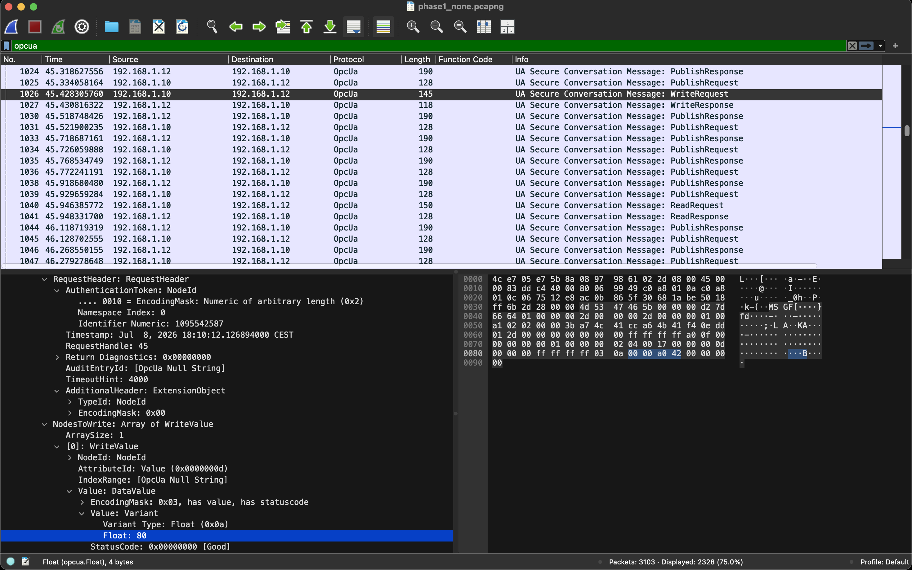
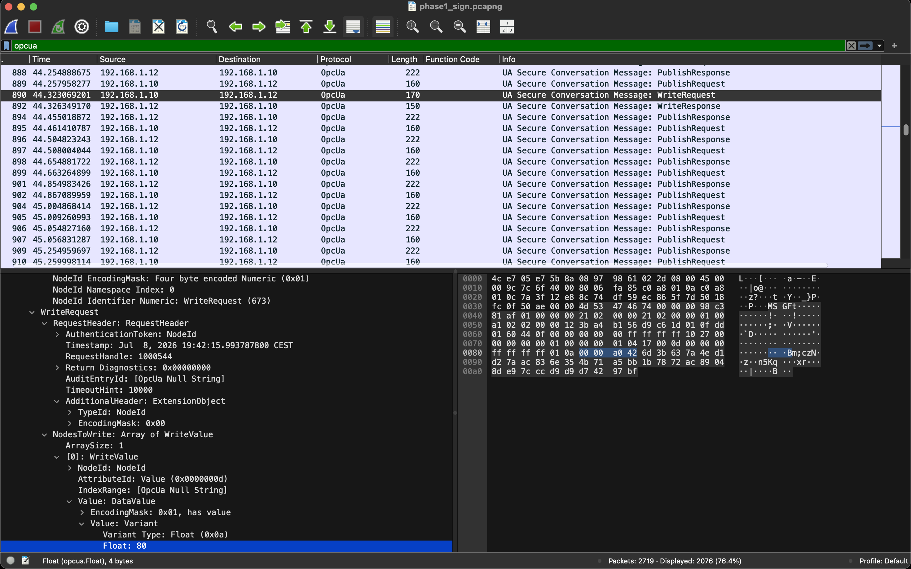
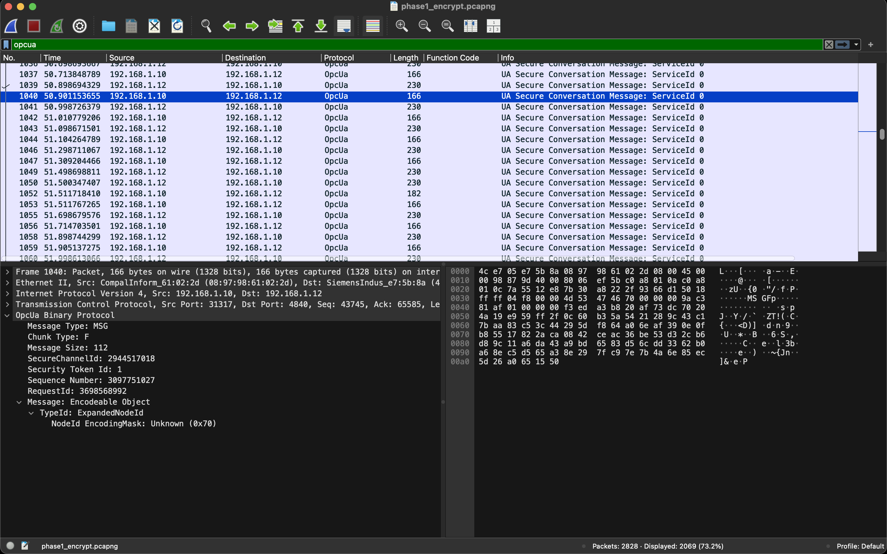

## Abstract

The preceding report in this series [LTR-2026-04] established, on physical hardware, that strong transport encryption removes the vantage from which a passive observer can read an industrial control action, not the logic by which such an action might be evaluated, and it left open how widely that vantage problem bites. This report takes up the question for OPC UA, the vendor-neutral protocol of the supervisory and integration layer, and finds that its answer is a gradient rather than a verdict.

OPC UA does not present the binary that a transport such as TLS does. It defines three message security modes, None, Sign, and SignAndEncrypt, negotiated per channel alongside a security policy that names the algorithm suite. We show that the mode alone, not the policy, decides what a passive observer recovers, and we document the result mode by mode with capture evidence: under None the full exchange is legible; under Sign it is equally legible and additionally authenticated; under SignAndEncrypt only the transport envelope survives. The intermediate mode is the finding of interest. Sign has no clean analogue in a transport protocol, and it is the one configuration that delivers integrity and authenticity on the wire while leaving the traffic fully visible to a legitimate observer.

We place this against the measured state of deployment. Internet-wide studies five years apart, from 2020 and from 2024 to 2025, agree that a large and persistent fraction of observable OPC UA runs without confidentiality, driven not by weakness in the cryptography but by the configuration burden of activating it. The legible case is therefore the common one, and for OPC UA the observation vantage is not fixed but selected, per channel, by a security-mode choice made elsewhere.

**Keywords:** OPC UA, IEC 62541, industrial protocols, message security mode, encryption adoption, passive monitoring, observation vantage.

## 1. Introduction

The report that precedes this one in the series examined a single encrypted control
channel, the web interface of a Siemens S7-1200 controller carried over TLS 1.3, and drew
one architectural conclusion from it. Under strong transport encryption a passive observer
positioned on a mirror port sees nothing of the payload. The exchange still crosses the
wire, but its contents are opaque, and no amount of positioning or decoding recovers them
without the keys. That report [LTR-2026-04] named this the vantage problem: encryption does not defeat
the logic by which one might evaluate an industrial action, it removes the vantage from
which the action can be seen at all. It also left a question open, namely how much of
operational technology is actually encrypted, and therefore how widely the vantage problem
bites in practice.

This report takes up that question for one protocol, and finds that the answer is more
interesting than a straight yes or no. OPC UA is the natural place to look. It is the
vendor-neutral protocol of the supervisory and integration layer, the channel over which
operator setpoints, HMI writes, and process telemetry increasingly travel, and it is
explicitly designed to be secure. Yet its security is not the binary that TLS presents.
Where TLS effectively offers a choice between an encrypted channel and none, OPC UA offers
three message security modes, and the middle one has no clean equivalent in the transport
world. That middle mode, Sign, protects a message's integrity and authenticity with a
signature while leaving its contents in clear. A deployment running it has made a real
security decision and is nonetheless fully legible to a passive observer.

This distinction is the organising idea of the report. The vantage problem, as posed for
TLS, is all-or-nothing: either the observer sees the exchange or it does not. OPC UA
refines the picture into a gradient. There is a mode under which the observer sees
everything, a mode under which the observer sees everything and knows the traffic is also
authentic, and a mode under which the observer sees only the envelope. Which of the three a
given deployment runs is therefore not a detail but the single fact that decides what
passive monitoring can achieve against it.

The report is deliberately confined to the protocol and the published evidence. It
characterises the three modes and the algorithm suites beneath them (Section 3), sets out
how much real OPC UA runs in each, and why, from internet-wide measurement (Section 4), and
documents what a passive observer recovers under each mode, with capture evidence (Section
5). It draws the implications for passive monitoring of OPC UA (Section 6) and closes by
placing the result in the wider arc of this series (Section 7). Throughout, the concern is
what the protocol exposes and conceals, not any particular system built to consume it. The
prior machinery needed to follow the argument, how an OPC UA client and server establish a
connection and exchange data, is set out first, in Section 2.

## 2. How OPC UA Communicates

Understanding what a passive observer sees requires a working picture of how an OPC UA
client and server actually talk. This section gives only what the rest of the report
needs, in the order the exchange unfolds.

An OPC UA conversation is built in layers, and the security-relevant structure sits in the
first two. When a client approaches a server it begins by asking what the server offers,
through the GetEndpoints service. The server replies with a list of endpoints, each
describing a supported combination of security mode, security policy, and transport, along
with the server's certificate. This exchange is what lets a client discover, before any
secure connection exists, which of the modes described in Section 3 a given server will
accept. It is also, for the same reason, visible to an observer: the negotiation of
security happens in clear, because there is not yet a secure channel to protect it.

The client then chooses an endpoint and establishes a **SecureChannel** through the
OpenSecureChannel service. The SecureChannel is the cryptographic foundation of everything
that follows. During its creation the two sides exchange and validate certificates,
agree on the algorithms named by the chosen security policy, and derive the keys used to
sign and, where the mode requires it, encrypt every subsequent message. The SecureChannel
is maintained by the communication stack rather than the application, and it is at this
layer that the message security mode takes effect. Whether the payloads that travel inside
the channel are merely signed or also encrypted is fixed here, and it is this single
choice that determines everything in Section 5.

On top of the SecureChannel the client creates a **Session**, through the CreateSession and
ActivateSession services. The distinction between the channel and the session matters. The
SecureChannel secures the transport; the Session represents the application-level
relationship and carries the user identity, established when the client activates the
session and proves who it is. When the server creates a session it returns an
authentication token, which the client attaches to every subsequent request so the server
can associate that request with the session. Under None and Sign this token travels in
clear, which is why, as Section 5 notes, an observer recovers a handle on the acting
session and not merely the bare action.

With a session active, the actual work is done through a small set of services. The two
that concern this report are the ones that read and write data. A **Read** returns the
current value of one or more node attributes; a **Write** sets them. When an operator
changes a setpoint, or an HMI pushes a new value to a controller, it is a Write that
crosses the wire, addressed to a specific node and carrying a specific value. These are the
actions a contextual monitor would care about, and under an unencrypted mode they are
recovered in full.

Process data that changes continuously is usually not polled one Read at a time but
delivered through the **publish-subscribe** mechanism. A client creates a subscription and
registers monitored items, one per node it wants to watch, and the server thereafter pushes
notifications whenever those values change, batched into publish responses. This is the
normal way a supervisory client keeps a live view of process variables such as levels,
pressures, or temperatures. For an observer it has a useful consequence and one
complication. The useful consequence is that, under an unencrypted mode, the stream of
notifications lets the observer reconstruct the trajectory of a process variable over time
without ever querying the server. The complication is that a notification identifies its
monitored item by a client-assigned handle rather than by the node's own identifier, with
the association between the two established earlier when the monitored item was created. An
observer that joins after that point sees the values but must do additional work to attach
each one to the node it belongs to. This detail becomes relevant to any system that
consumes the process trajectory, and it is noted here rather than laboured.

This is the whole of the machinery the report relies on [2]: a clear-text negotiation of
security, a SecureChannel that fixes what protection applies, a Session that carries
identity, and Read, Write, and publish-subscribe services that carry the actions and the
process state. Everything in the sections that follow concerns what survives of this
exchange under each security mode.

## 3. The Three Message Security Modes

OPC UA does not treat security as a single on-or-off property. Each communication
channel is governed by two parameters that are negotiated separately when a client and
server connect. The *message security mode* determines what cryptographic protection is
applied to each message. The *security policy* names the algorithm suite that provides
it. An endpoint advertises a combination of the two, and a client must support the same
combination for the connection to succeed. The distinction runs through the rest of this
report: the mode decides *what* is protected, the policy decides *how*, and the two are
chosen independently.

Three message security modes are defined: None, Sign, and SignAndEncrypt. They are less
three points on one scale of strength than three answers to two separate questions,
whether a message's integrity is protected and whether its contents are kept
confidential.

**None** applies no cryptographic protection. Messages travel in clear text, unsigned
and unencrypted. The specification and vendor guidance agree that this mode is meant only
for development, testing, or debugging, and not for production. Under None, any party that
can observe the network reads the full content of every message, and any party that can
inject traffic can forge or alter messages undetected.

**Sign** attaches a digital signature to every message. This protects integrity and
authenticity: an altered message fails the signature check and is rejected, and the
signature binds the message to the sending application's certificate. It does not conceal
anything. The payload stays in clear text and remains readable to any party capturing the
traffic. Sign thus occupies an intermediate position with no clean equivalent in a
transport such as TLS, where enabling protection ordinarily means enabling encryption
too. It confirms that an observed action is authentic and unmodified while leaving that
action fully visible.

**SignAndEncrypt** applies both protections. Each message is signed for integrity and
authenticity, then encrypted for confidentiality, so an observer sees neither the
contents nor any usable structure, only the outer envelope of the secure channel. This is
the mode that OPC UA guidance and the IEC 62541 standard recommend for production
deployments where both integrity and confidentiality are required [1, 4].

Three modes exist, rather than the familiar secure-or-not pair, because OPC UA separates
integrity from confidentiality as independent choices. Signing provides integrity and
authenticity; encryption provides confidentiality; and an operator may require the first
without the second. This reflects real operational needs. In some settings tampering and
impersonation are the primary threats while the data itself is not sensitive, and the
cost of encryption, or a deliberate wish to keep traffic visible for monitoring and
diagnostics, makes signing without encryption a reasonable choice rather than an
oversight.

### 3.1 Security Policies: the Algorithm Suite

The mode decides whether messages are signed and encrypted; the policy decides which
algorithms do it. A security policy is a named bundle that fixes three things at once:
the asymmetric algorithm used during the initial handshake to authenticate the parties
and agree on keys, the symmetric algorithm that protects the bulk of the traffic
thereafter, and the hash function used to build signatures. The name encodes the bundle.
`Basic256Sha256`, the policy most commonly encountered in the field and the current
baseline recommendation, pairs RSA-based asymmetric operations with 256-bit symmetric
encryption and the SHA-256 hash. The specification classifies it as suitable for
configurations with high security needs and, as of the current edition, gives it no
published expiry date. Two newer policies, `Aes128Sha256RsaOaep` and
`Aes256Sha256RsaPss`, keep the SHA-256 hash but use more modern AES-based encryption and
updated RSA padding, and are preferred where every device in a deployment supports them.

Not every available policy is safe. `Basic128Rsa15` and `Basic256` were deprecated
because they rely on 1024-bit RSA keys or the SHA-1 hash, neither considered secure
today, yet they remain widely supported in deployed equipment for backward
compatibility. A server that still advertises them weakens the protection available to
any client that negotiates one. The full normative list and the exact primitives of each
policy are given in Part 7 of the OPC UA specification [3]. Because mode and policy are set
independently, a channel is only as strong as the weaker of the two: a deployment may be
sound in mode but rest on a weak policy, or support a strong policy yet default to None.

One consequence of this split matters specifically for a passive observer, and is worth
stating directly because it is easy to assume otherwise. The policy does not change what
an observer can read; only the mode does. Whether a payload is legible on the wire is a
property of the mode: Sign leaves it in clear text, SignAndEncrypt conceals it. The
policy governs the algorithms that sign and encrypt, not whether encryption is applied.
A signed-but-unencrypted message is equally readable whether signed under Basic256Sha256
or a newer AES-based policy, and an encrypted message is equally opaque whichever policy
produced the ciphertext. For the question this report examines, what a passive observer
recovers, the policy axis is orthogonal and can be set aside: the three modes are the
only distinction that changes visibility.

One narrow exception applies. The negotiated policy is itself observable, because the
`SecurityPolicyUri` is exchanged in clear text during the handshake, before a secure
channel exists to protect it. An observer can see which policy and mode a session uses
even when it cannot read the session's contents. This is channel metadata, not payload:
knowing that a session runs SignAndEncrypt under Basic256Sha256 confirms the traffic is
encrypted and identifies the suite, but does not help recover what was sent. The
measurements in this report were all taken under Basic256Sha256; that visibility is
independent of the policy follows from the clear-versus-encrypted distinction being a
property of the mode, and is not expected to vary across policies.

## 4. Encryption Adoption in Practice

The preceding section describes what OPC UA offers. What deployments actually use is a
different matter, and the gap between the two is the reason passive observation of OPC UA
traffic is not a niche concern. Two independent measurement efforts, five years apart,
give a consistent picture.

The first landmark study was carried out by Dahlmanns et al. and published at the ACM
Internet Measurement Conference in 2020 [5]. Scanning the reachable IPv4 space weekly from
February to August 2020, the authors assessed 1114 reachable OPC UA deployments and found
that 92% carried some security misconfiguration. Around a quarter of deployments used no
OPC UA security at all, a further quarter that did enable security relied on insecure
cryptographic primitives such as SHA-1, roughly a third reused certificates including
vendor defaults, and close to half operated without an allow-list restricting which
clients could connect. The study also observed several hundred devices across different
networks sharing a single certificate, which alone permits impersonation.

The weakness is not confined to how deployments are configured; it reaches into the
implementations themselves. A systematic study by Erba et al. examined 48 publicly
available OPC UA products and libraries and found security issues in 38 of them, with
seven supporting none of the protocol's security features at all and most of the remainder
shipping incomplete implementations or misleading guidance [8]. An operator who enables
security in good faith may therefore still inherit a weak result from the stack beneath.

A more recent effort by Bitsight, covering June 2024 to June 2025, shows the problem has
not receded as OPC UA adoption has grown [6]. Their monitoring identified 14,220 unique
internet-exposed OPC UA devices across 99 countries. Of these, over half allowed
unauthenticated access, and 80.26% supported the None mode, meaning they were willing to
exchange data in plain text with no integrity protection. Nearly nine in ten supported at
least one deprecated security policy of the kind described in the previous section. The
overwhelming majority, close to 97%, were reachable on the standard OPC UA port, which
makes them trivial to enumerate at internet scale.

The two studies measure different things. Dahlmanns et al. assessed the configuration of
reachable deployments, while Bitsight measured exposure and what devices were willing to
offer. They are not directly comparable figure for figure, and neither claims that a
majority of all OPC UA in the world is insecure, since only internet-reachable systems are
visible to a scanner. What they establish together is narrower and more durable: across a
five-year span and independent methodologies, a large and persistent fraction of
observable OPC UA runs without the confidentiality the protocol is capable of providing.

The cause is not a weakness in the cryptography. OPC UA is widely regarded as secure by
design, and its signing and encryption, correctly configured, are sound. The failure is
one of activation rather than capability. Turning on SignAndEncrypt requires a working
public-key infrastructure: certificates must be generated, exchanged between client and
server, placed in the correct trust stores on both sides, and renewed before they expire.
Industry guidance from the OPC Foundation and associated security working groups documents
this configuration burden directly, noting that device and machine builders frequently
struggle with exactly these steps [9]. Where the secure path demands manual certificate
handling and the insecure path demands nothing, deployments drift toward None, and the
None mode persists in production long after its intended use in development and testing.

This produces a characteristic pattern that recent field reporting captures well:
attackers seldom attack the cryptography, because they rarely need to [10]. The vectors that
work in practice are anonymous access left enabled, trust lists that do not enforce
certificates, deprecated ciphers no one removed, and servers left reachable from the open
internet. The protection is present in the specification and absent from the deployment.
For the purposes of this report, the same gap that an attacker exploits is what a passive
defender observes: a substantial share of real OPC UA traffic is carried in None or Sign,
and is therefore legible on the wire. The next section sets out precisely what that
legibility amounts to, mode by mode.

## 5. What Passive Observation Recovers

Sections 3 and 4 established two things: that the message security mode, not the policy,
decides whether a payload is legible, and that a large and durable fraction of real OPC UA
runs in None or, less often, in Sign. This section makes the consequence concrete. It
asks what a passive observer actually recovers from OPC UA traffic under each of the three
modes, and answers with capture evidence.

The observation model is deliberately minimal and entirely passive. Traffic is captured at
a network vantage point, for example a mirror or tap that copies frames without
participating in the exchange, and decoded with a standard protocol dissector. The
observer never connects to the server, never issues a request, and never holds any key
material. It sees only what crosses the wire. This is the weakest possible position, and
precisely for that reason it establishes a lower bound: whatever is recoverable here is
recoverable by any monitoring arrangement with at least this much access.

**None.** Under the None mode the dissector resolves the message in full. The service
being invoked is identified, the target of the operation is resolved to its namespace and
identifier, and the written or returned value is decoded with its type. A write operation,
for instance, is recovered end to end: the observer learns that a write occurred, which
node it addressed, and the value it carried. Figure 1 shows a write request captured
under None, with the target node and the value both in clear.

<figure>

<figcaption>Figure 1. A WriteRequest captured under the None mode. The dissector resolves the message in full: the service is identified as a WriteRequest, the request carries a clear-text authentication token identifying the acting session, and the written value (a Float) is decoded end to end. Nothing is concealed.</figcaption>
</figure>

Two further points are worth noting because they are properties of the protocol structure
rather than of any particular deployment. First, a request of this kind also carries the
session's authentication token, which travels in clear under None and identifies the
acting session, so the observer recovers not only the action but a handle on who performed
it. Second, the same clarity applies to the streamed process data delivered by the
publish-subscribe mechanism: the values a server pushes to its subscribers are decoded
sample by sample, so the observer can reconstruct the trajectory of a monitored variable
over time. Under None, in short, the observer sees essentially everything of interest:
actions, their targets and values, the acting session, and the evolving process state.

**Sign.** The Sign mode changes nothing about legibility. Because signing protects
integrity without applying encryption, every field that was recoverable under None remains
recoverable under Sign. A write request still resolves to its target and value, and the
streamed process values still decode sample by sample. Figure 2 shows the same kind of
write recovered under Sign: the target node, the attribute, and the value are all in clear,
exactly as under None. The one visible difference is the signature. The message is larger
than its None counterpart, and the trailing bytes of the frame carry the cryptographic
signature that authenticates it. The payload sits in front of that signature, fully
readable.

<figure>

<figcaption>Figure 2. The same kind of write captured under the Sign mode. The target node, the attribute, and the value decode in clear exactly as under None. The message is larger than its None counterpart, and the trailing bytes carry the cryptographic signature that authenticates it. The payload precedes the signature and remains fully readable.</figcaption>
</figure>

This is the intermediate case at the centre of this report. A deployment running Sign has
made a genuine security decision: its traffic is protected against tampering and
impersonation, and a forged or altered message would be rejected. Yet to a passive
observer that traffic is exactly as legible as None. The integrity guarantee and the
confidentiality guarantee are decoupled, and Sign takes the first without the second. For
a defender observing the network this is the most favourable configuration of all, because
it combines authenticity on the wire with full visibility of what is happening.

**SignAndEncrypt.** The SignAndEncrypt mode collapses this visibility. With the payload
encrypted, the dissector resolves none of it: the service, the target node, and the value
are all absent. What survives is the outer envelope of the secure channel. The observer
can still see that an OPC UA secure-channel message passed between two endpoints, the
identifier of the secure channel it belongs to, and the size and timing of each message.
Figure 3 shows a message under SignAndEncrypt, where only the envelope fields are
populated and the message body is opaque.

<figure>

<figcaption>Figure 3. A message captured under the SignAndEncrypt mode. The dissector resolves none of the payload: the service reads as an unresolved identifier and the message body is opaque. Only the transport envelope survives, namely the message type, the secure-channel identifier, and the message size. The action itself is not recoverable.</figcaption>
</figure>

The residue that survives encryption is metadata rather than content. Message size and
timing, the identity of the communicating endpoints, and the sequence of channel activity
remain observable, and in some circumstances traffic-analysis techniques can draw limited
inferences from them. Whether such inferences are useful is highly situation-dependent and
should not be overstated: against a backdrop of continuous, uniform traffic, an individual
action of interest may be indistinguishable from routine activity on the basis of size and
timing alone. Under SignAndEncrypt the passive observer is reduced to the envelope, and the
envelope rarely carries the action itself.

These results reduce to a compact observability map, summarised in Table 1. The mode
axis, and it alone, determines what a passive observer recovers. None and Sign are
equivalent for legibility and expose the full content of the exchange; SignAndEncrypt
exposes only the transport envelope. The one field that behaves differently is the
negotiated security configuration itself, which, as Section 3.1 noted, is announced in
clear during the handshake and is therefore observable under all three modes.

**Table 1. Observability by security mode.** For each mode, whether a passive observer
recovers each element of the exchange.

| Element | None | Sign | SignAndEncrypt |
|---|:---:|:---:|:---:|
| Service type (read, write, publish) | Recovered | Recovered | Absent |
| Target node | Recovered | Recovered | Absent |
| Value | Recovered | Recovered | Absent |
| Acting session (authentication token) | Recovered | Recovered | Absent |
| Process trajectory (publish stream) | Recovered | Recovered | Absent |
| Channel metadata (size, timing, endpoints) | Recovered | Recovered | Recovered |
| Signature present | No | Yes | Yes (opaque) |

The negotiated mode and policy are announced in clear during the handshake and are
observable under all three modes.

## 6. Implications

Three consequences follow from the observability map of Section 5, and they are worth
separating because they point in different directions.

The first concerns what passive monitoring of OPC UA can and cannot achieve, stated
plainly. Against a deployment running None or Sign, a passive observer recovers the full
substance of the exchange: the actions, their targets and values, the acting session, and
the trajectory of process state. Against a deployment running SignAndEncrypt, it recovers
only the envelope. There is no middle ground within a mode and no partial decoding; the
mode is the switch. Any monitoring capability that depends on reading OPC UA payloads is
therefore contingent on the mode in force, and its coverage is exactly the fraction of
observed traffic that runs None or Sign. Section 4 indicates that this fraction is, today,
substantial.

The second concerns Sign specifically, and it cuts against a common intuition. Sign is
often treated as a half-measure, a way station on the road to SignAndEncrypt. From the
standpoint of a defender who monitors the network, it is something more particular: the one
configuration that delivers integrity and authenticity on the wire while preserving full
visibility of the traffic. A message under Sign cannot be forged or altered undetected, and
it can still be read by a legitimate passive monitor. For an operator who wants assurance
that observed actions are genuine, without surrendering the ability to observe them, Sign is
not a compromise between security and visibility but the point at which both hold at once.
This is a property of OPC UA that its three-mode design makes available and that a binary
encrypted-or-not transport cannot express.

The third concerns SignAndEncrypt and is the honest limit of the passive approach. Where a
deployment does encrypt, passive observation of payload ends, exactly as it did under TLS in
the previous report. What remains is metadata: message sizes, timing, endpoints, and the
sequence of channel activity, together with the security configuration announced in clear
during the handshake. This residue supports coarse inferences at best, and Section 5 was
deliberately cautious about how much can be read from it. Encrypted OPC UA is not, on this
evidence, passively monitorable after all; rather, the boundary of passive monitoring is the
mode boundary, and recognising which side of it a given channel sits on is itself a useful
observation an observer can make without any keys.

Taken together these establish that, for OPC UA, the vantage available to passive monitoring
is not fixed but selected, per channel, by a configuration choice made elsewhere. This is a
sharper and more actionable statement than the one the transport case allowed, where the
vantage was simply absent whenever encryption was present.

## 7. Conclusion

OPC UA answers the question left open by the previous report with a gradient rather than a
verdict. Its three message security modes place a channel in one of three observability
states: fully legible under None, fully legible and authenticated under Sign, and reduced to
the transport envelope under SignAndEncrypt. The security policy, the algorithm suite beneath
the mode, changes the strength of the protection but not what a passive observer recovers;
only the mode does that. And the field evidence indicates that a large and durable share of
real OPC UA runs in the two legible modes, so the legible case is not a corner case but the
common one.

The finding of interest is the intermediate mode. Sign has no clean analogue in a transport
such as TLS, and it occupies a position that a binary framing of encryption cannot describe:
genuine cryptographic protection of integrity and authenticity, combined with complete
legibility to a passive observer. For the study of how industrial actions might be observed
and understood on the wire, this is the case that matters most, because it is where security
and visibility coexist rather than trade off.

This report has stayed within the protocol, characterising what OPC UA exposes and conceals
under each mode and grounding the account in capture evidence and published measurement. What
it has not addressed is what an observer might do with the exchange once recovered: how the
actions, values, and process trajectories that survive under None and Sign could be
interpreted, and to what end. That is the subject of work to come.

## References

[1] OPC Foundation. OPC Unified Architecture, Part 2: Security Model. IEC 62541-2. OPC Foundation, 2022.

[2] OPC Foundation. OPC Unified Architecture, Part 4: Services. IEC 62541-4. OPC Foundation, 2022.

[3] OPC Foundation. OPC Unified Architecture, Part 7: Profiles. IEC 62541-7. OPC Foundation, 2022.

[4] International Electrotechnical Commission. IEC 62541: OPC Unified Architecture. IEC, Geneva, 2020.

[5] M. Dahlmanns, J. Lohmöller, I. B. Fink, J. Pennekamp, K. Wehrle, and M. Henze. Easing the Conscience with OPC UA: An Internet-Wide Study on Insecure Deployments. In Proceedings of the ACM Internet Measurement Conference (IMC '20), pages 101–110, 2020. DOI: 10.1145/3419394.3423666.

[6] Bitsight TRACE. OPC UA Server Internet Exposures: 2025 Year in Review. Bitsight Technologies, 2025. https://www.bitsight.com/blog/opc-ua-server-internet-device-exposures-in-2025.

[7] R. Yaben and E. Vasilomanolakis. Drifting Away: A Cyber-Security Study of Internet-Exposed OPC UA Servers. In Proceedings of the 10th International Workshop on Traffic Measurements for Cybersecurity (WTMC 2025), co-located with IEEE European Symposium on Security and Privacy, 2025.

[8] A. Erba, A. Müller, and N. O. Tippenhauer. Security Analysis of Vendor Implementations of the OPC UA Protocol for Industrial Control Systems. CISPA Helmholtz Center for Information Security, 2022. arXiv:2104.06051.

[9] OPC Foundation and M2M Alliance security working group. Practical Security Guidelines for Building OPC UA Applications. OPC Foundation, 2018. https://opcconnect.opcfoundation.org/2018/06/practical-security-guidelines-for-building-opc-ua-applications/.

[10] FlowFuse. OPC UA Security: How Threat Actors Exploit Industrial Protocol Vulnerabilities. FlowFuse, 2026. https://flowfuse.com/blog/2026/05/opc-ua-security-attack-vectors/.

[11] B. Salmazo. Contextual Evaluation under Encryption. Liscere Technical Report LTR-2026-04, 2026.

Liscere Technical Report · LTR-2026-05 · v1 · liscere.com
